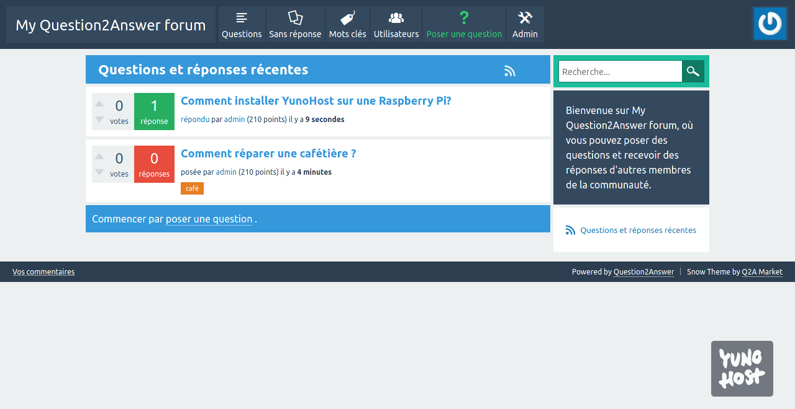

# Question2Answer for YunoHost

[](https://dash.yunohost.org/appci/app/question2answer)    
[](https://install-app.yunohost.org/?app=question2answer)

*[Lire ce readme en français.](./README_fr.md)*

> *This package allows you to install Question2Answer quickly and simply on a YunoHost server.  
If you don't have YunoHost, please consult [the guide](https://yunohost.org/#/install) to learn how to install it.*

## Overview
Question2Answer (Q2A) is a popular open source Q&A platform for PHP/MySQL.

**Shipped version:** 1.8.5

## Screenshots



## Demo

* [Official demo](http://demo.question2answer.org/)

## Configuration

This app can be configured via its admin panel, available at `https://mydomain/myquestion2answer/index.php/admin/`

## Documentation

 * Official documentation: https://www.question2answer.org/
 * YunoHost documentation: If specific documentation is needed, feel free to contribute.

## YunoHost specific features

#### Multi-user support

This app supports multiuser and LDAP, but is not integrated via SSO.
The admin page is protected by SSOwat.

#### Supported architectures

* x86-64 - [](https://ci-apps.yunohost.org/ci/apps/question2answer/)
* ARMv8-A - [](https://ci-apps-arm.yunohost.org/ci/apps/question2answer/)

## Limitations

* No known limitations.

## Additional information

**More info on the documentation page:**  
https://yunohost.org/packaging_apps

## Links

 * Report a bug: https://github.com/nils-van-zuijlen/question2answer_ynh/issues
 * App website: https://www.question2answer.org
 * Upstream app repository: https://github.com/q2a/question2answer
 * YunoHost website: https://yunohost.org/

---

## Developer info

Please send your pull request to the [testing branch](https://github.com/YunoHost-Apps/question2answer_ynh/tree/testing).

To try the testing branch, please proceed like that.
```
sudo yunohost app install https://github.com/YunoHost-Apps/question2answer_ynh/tree/testing --debug
or
sudo yunohost app upgrade question2answer -u https://github.com/YunoHost-Apps/question2answer_ynh/tree/testing --debug
```
